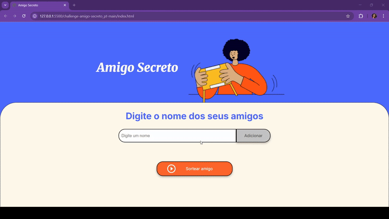

# challenge-amigo-secreto_ONE_G9
Challenge Amigo secreto criado como requisito no curso ONE

# 🎁 Amigo Secreto

## 📖 Descrição
Este projeto é uma aplicação simples em **HTML, CSS e JavaScript** que simula o sorteio de **Amigo Secreto**.  
O usuário pode adicionar nomes a uma lista e, ao final, realizar um sorteio aleatório para descobrir quem é o amigo secreto.

---

## ⚙️ Funcionalidades
- ➕ **Adicionar nomes** à lista de amigos.
- ✅ **Validação de entrada** (não permite nomes vazios).
- 📃 **Visualizar a lista** de amigos adicionados.
- 🎲 **Sortear um amigo** aleatoriamente.
- 🎥 Demonstração em vídeo e imagem do funcionamento.

---

## 🚀 Como utilizar
1. Abra o projeto em um navegador utilizando o **Live Server** (ou apenas clicando no arquivo `index.html`).
2. Digite o nome de um amigo no campo de texto.
3. Clique em **Adicionar** para inserir o nome na lista.
4. Repita o processo para todos os participantes.
5. Clique em **Sortear amigo** para selecionar um nome aleatório.

---

## 🆘 Onde encontrar ajuda
Caso tenha dúvidas sobre o uso ou queira contribuir:
- Consulte a [documentação do JavaScript](https://developer.mozilla.org/pt-BR/docs/Web/JavaScript)
- Abra uma **issue** neste repositório do GitHub
- Entre em contato com os autores

---

## 👩‍💻 Autores
- # Autores
| [ Adilma Alves]|
| :---: | 
- Projeto desenvolvido como exercício de prática em **JavaScript e DOM**.

